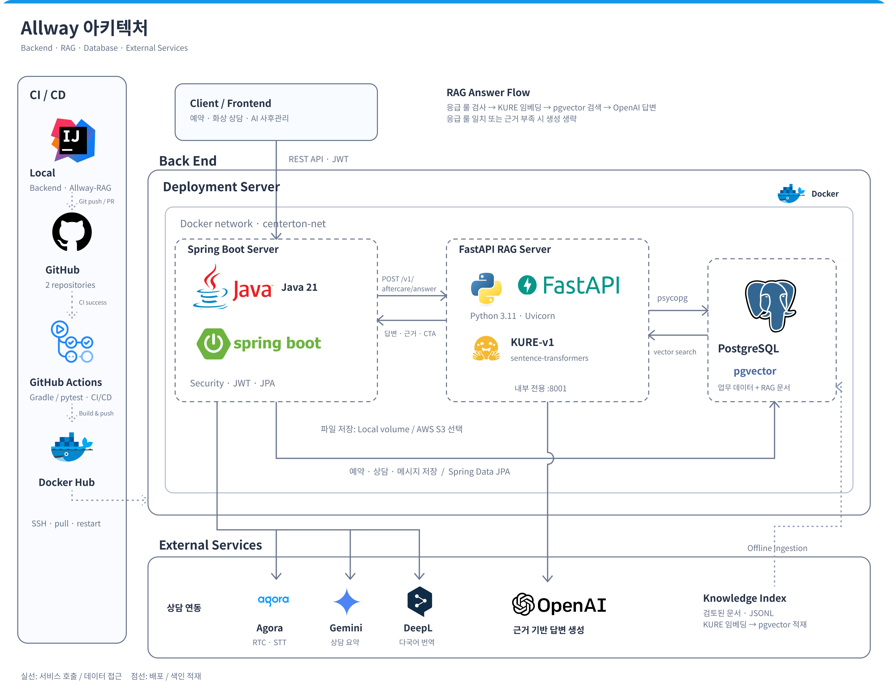

# 🏥 사후관리 RAG — FastAPI AI Answer Server

> **시술 후 증상 문의를 검증된 근거에 묶인 답변으로 바꿉니다.**
>
> _"추측하지 않는다. 근거가 없으면 답하지 않는다."_

피부과·성형외과 시술을 받은 환자가 증상과 사진을 입력하면 **응급 여부 판정 · 검증된 사후관리 근거 검색 ·
근거 기반 답변**을 생성하는 AI 답변 서버입니다.

Spring Boot 백엔드가 인증과 대화 저장을 담당하고, 이 FastAPI 서버가 응급 룰 검사와 RAG 파이프라인을
실행합니다. 응급 신호가 잡히면 임베딩·검색·생성을 모두 중단하고 고정 안내를 반환하며, 검색된 근거가
유사도 기준을 넘지 못하면 생성 모델을 호출하지 않습니다.

---

## 🔹 주요 기능

### 1. 🚨 응급 hard-stop 룰 검사
- RAG·LLM 보다 먼저 실행되는 9개 위험 카테고리 룰셋
- 매칭되면 자유 생성과 검색을 중단하고 고정 안내 반환 (LLM 호출 0회, 응답 0.3초)
- 여러 룰이 동시에 잡히면 모든 안내를 함께 전달 (필러 혈관 경고가 일반 안내로 대체되지 않음)
- `~지 않`, `~없` 형태의 증상 부재 보고를 응급으로 오탐하지 않음

### 2. 🔎 검증된 근거 검색
- KURE-v1 한국어 임베딩 + pgvector 코사인 유사도
- 큐레이션 15건 + 국내 공식 15건 + 식약처/FDA/AAD/ASPS 74건 = 기본 색인 104건
- `retrieval_use` 허용목록으로 확장 참고 자료와 평가 홀드아웃의 유입 차단
- `RAG_MIN_SIMILARITY` 미달 문서는 가중치를 낮추지 않고 근거에서 제거

### 3. 🧾 근거 기반 답변 생성
- 검색된 문서의 `title`·`content`·`answer_template`·`source`·유사도를 프롬프트에 전달
- 상태 요약 → 관리 방향 → 병원 연락 기준 → 사용한 근거 문서 4단 구성
- 근거에 없는 처치·약 복용·항생제·확정 진단을 만들지 않음
- 근거가 0건이면 **생성 모델을 호출하지 않고** 보수적 안내로 종료

### 4. 🖼️ 이미지 동반 문의 처리
- Spring 이 저장한 이미지를 base64 data URL 로 인라인 전달
- 실제 이미지를 최종 생성 호출에 함께 넣어 텍스트 설명으로 손실되지 않게 처리
- 사진만으로 진단을 확정하지 않도록 프롬프트에서 억제

### 5. 💬 상담 전환 CTA 도출
- 검색된 근거의 `risk_level`·`dataset_type` 에서 결정론적으로 파생 (추가 LLM 호출 없음)
- `urgent_clinic` 이 `video_consult` 보다 우선 — urgent 근거를 예약 상담으로 축소하지 않음
- 검색 앞단의 LLM 분류기를 제거해, 화상상담용으로 작성한 문서가 검색되지 않는 모순을 해소

### 6. 🔁 Java 매처 계약 동기화
- Spring 1차 hard-stop 과 FastAPI 2차 검사가 같은 룰북·같은 매칭 규칙을 사용
- 회귀 66건을 Python·Java 양쪽에서 채점해 두 구현이 갈라지면 빌드가 깨지도록 고정

---

## 🧩 기술 구조도



- Spring Boot 백엔드는 인증·이미지 저장·대화 이력·앱 응답을 담당합니다.
- FastAPI 서버는 응급 판정, 임베딩 검색, 근거 기반 생성을 담당합니다.
- 두 서버는 같은 도커 네트워크(`centerton-net`)에 붙고, RAG 서버는 외부에 노출하지 않습니다.
- 응급 룰은 두 서버가 같은 룰북 파일을 읽고, 같은 매칭 규칙을 구현합니다.

---

## 🚀 기술 스택

- **Language / Runtime**: Python 3.11+

  

- **Framework**: FastAPI, Uvicorn, Pydantic

  
  
  

- **Embedding / Retrieval**: KURE-v1, sentence-transformers, pgvector

  
  
  

- **Generation**: OpenAI Responses API

  

- **Database**: Azure Database for PostgreSQL

  
  

- **Build / Deploy**: pip, Docker, GitHub Actions

  
  
  

---

## 🔁 처리 흐름

```text
📱 Mobile App
    │ 증상 문의 + 사진
    ▼
🏥 Centerton Backend (Spring Boot)
    │ 인증 · 메시지 저장
    ├─▶ 🚨 1차 응급 룰 검사 ── 매칭 ──▶ 고정 안내 반환 (FastAPI 호출 없음)
    │                            불일치
    ▼
🤖 Centerton RAG Server (FastAPI)
    │
    ├─▶ 🚨 2차 응급 룰 검사 ── 매칭 ──▶ 고정 안내 (임베딩·검색·생성 금지)
    │                            불일치
    ├─▶ 🧠 KURE-v1 질문 임베딩
    ├─▶ 🗄️ pgvector 기본 색인 104건 검색
    │      └─ 유사도 미달 또는 0건 ──▶ 근거 부족 안내 (OpenAI 호출 금지)
    ├─▶ ✍️ OpenAI 근거 기반 답변 생성
    └─▶ 💬 상담 CTA 도출 (근거 메타데이터 기반)
```

---

## 📁 패키지 구조

```text
.
├─ docs
│  ├─ adr                    # 아키텍처 결정 기록(ADR)과 Notion 원본 마이그레이션 문서
│  └─ images                 # README 기술 구조도 이미지
├─ centerton_rag
│  ├─ main.py                  # FastAPI 엔트리포인트 / 답변 API
│  ├─ config.py                # 환경변수 기반 설정, 검색 티어 허용목록
│  ├─ emergency.py             # 응급 hard-stop 게이트 (매칭 로직은 룰북 매처에 위임)
│  ├─ retrieval.py             # pgvector 검색, 유사도 컷, 티어 경계
│  ├─ answer.py                # 프롬프트 구성, 생성 게이트, 안전 가드레일
│  ├─ consultation.py          # 근거 메타데이터에서 상담 CTA·위험도 도출
│  └─ models.py                # 요청·응답 스키마
├─ rag_rulebook
│  ├─ rules
│  │  ├─ emergency_rules.json  # 9개 위험 카테고리 hard-stop 룰셋
│  │  └─ triage_policy.json    # 라우팅 정책 문서
│  ├─ rag
│  │  └─ mvp_care_knowledge.jsonl        # 큐레이션 사후관리 15건
│  ├─ derived
│  │  ├─ official_rag_candidate_chunks.jsonl   # 국내 공식 근거 15건
│  │  ├─ trusted_rag_candidate_chunks.jsonl    # 식약처/FDA/AAD/ASPS 74건
│  │  └─ retriever_index_manifest.json         # 색인 계층과 건수 선언
│  ├─ test_cases
│  │  ├─ emergency_rule_regression.json  # 응급 룰 회귀 66건
│  │  └─ integration_scenarios.json      # 통합 시나리오와 기대 라우팅
│  ├─ sources                  # 출처별 원문 텍스트와 용도 분류 인덱스
│  └─ tools
│     ├─ emergency_matcher.py            # 룰북 계약 구현 (Java 매처와 1:1)
│     ├─ validate_emergency_rules.py     # 회귀 66건 채점
│     ├─ validate_dataset_baseline.py    # 색인 구성·건수·누출 검증
│     ├─ validate_triage.py              # 통합 시나리오 라우팅 검증
│     └─ build_rag_datasets.py           # 원문 → 청크 JSONL 생성
├─ integrations/spring         # Spring 이식용 Java 매처와 회귀 테스트
├─ scripts
│  ├─ ingest_rag_documents.py  # 색인 적재 (KURE 임베딩 + pgvector upsert)
│  ├─ query_rag_documents.py   # 임의 질문으로 색인 조회
│  └─ evaluate_embedding_retrieval.py    # 임베딩 제공자 비교
├─ verification                # 검색·생성 재측정 probe
├─ tests                       # 계약 테스트 40건
├─ pyproject.toml
└─ Dockerfile
```

---

## 📚 의사결정 기록

RAG 도입, 안전 룰 우선 구조, 데이터셋 분리, pgvector 전환, Spring/FastAPI 경계, triage 제거 같은 설계 결정은 [docs/adr](docs/adr/README.md)에 정리되어 있습니다.

---

## 🔌 주요 API

| Method | Endpoint | 설명 | 인증 |
|---|---|---|:---:|
| GET | `/health` | 색인 버전·룰북 버전·임계값 확인 | — |
| POST | `/v1/aftercare/answer` | 증상 문의에 대한 근거 기반 답변 생성 | — |

> 이 서버는 자체 인증이 없습니다. 도커 네트워크 내부에서 Spring 만 호출하도록 하고,
> 호스트 포트로 공개하지 않습니다.

### `route` 값

| route | 의미 | LLM 호출 | 근거 문서 |
|---|---|:---:|:---:|
| `hard_stop` | 응급 룰 매칭. 고정 안내 반환 | 없음 | 없음 |
| `rag_answer` | 근거 기반 답변 생성 | 1회 | 1~5건 |
| `insufficient_evidence` | 유사도 기준 미달 또는 0건 | 없음 | 없음 |

`hard_stop` 일 때만 `systemActions` 가 채워지고, `rag_answer` 일 때만 `consultationCta` 가 채워집니다.

---

## ⚙️ 환경변수

| 이름 | 설명 | 기본값 |
|---|---|---|
| `DATABASE_URL` | pgvector 가 설치된 PostgreSQL 주소 (`jdbc:` 접두사 허용) | — |
| `DATABASE_USERNAME` | DB 사용자 | — |
| `DATABASE_PASSWORD` | DB 비밀번호 | — |
| `RAG_INDEX_VERSION` | 검색 대상 색인 버전 | `2026-08-20-translated-corpus` |
| `RAG_TOP_K` | 근거로 사용할 문서 수 | `5` |
| `RAG_MIN_SIMILARITY` | 이 값 미달 문서는 근거에서 제거 | `0.50` |
| `RAG_ALLOWED_RETRIEVAL_USE` | 검색 허용 티어 (쉼표 구분) | `curated,official_rag_candidate,trusted_rag_candidate` |
| `RAG_ALLOW_NULL_RETRIEVAL_USE` | 티어가 비어 있는 행을 허용할지 | `false` |
| `KURE_MODEL` | 임베딩 모델 | `nlpai-lab/KURE-v1` |
| `OPENAI_API_KEY` | 생성 모델 키 | — |
| `OPENAI_BASE_URL` | 생성 모델 엔드포인트 | `https://api.openai.com` |
| `OPENAI_MODEL` | 생성 모델 | `gpt-5.6-luna` |
| `OPENAI_MAX_OUTPUT_TOKENS` | 생성 최대 토큰 | `900` |
| `RAG_RULEBOOK_ROOT` | 룰북 경로. 이미지에 구워져 있어 기본값 유지 권장 | `/app/rag_rulebook` |

`RAG_ALLOWED_RETRIEVAL_USE` 에서 `curated` 를 빼면 검토된 큐레이션 문서 15건이 검색에서
사라집니다. 임계값이나 임베딩 모델을 바꾸면 저장된 벡터 기준이 무효가 되므로 재적재와 재측정이
필요합니다.

---

## 🧪 로컬 실행

### 1. 설치

```bash
python3 -m venv .venv
source .venv/bin/activate
pip install -e .
cp .env.example .env      # 값 채우기
```

### 2. 서버 실행

```bash
set -a; . ./.env; set +a
uvicorn centerton_rag.main:app --host 127.0.0.1 --port 8001
```

헬스 체크:

```bash
curl http://127.0.0.1:8001/health
```

### 3. 답변 요청

```bash
curl -s -X POST http://127.0.0.1:8001/v1/aftercare/answer \
  -H "Content-Type: application/json" \
  -d '{"question":"코 수술 2주차인데 코끝이 약간 휜 것 같아요. 재수술해야 하나요?"}' \
  | python -m json.tool --no-ensure-ascii
```

응급 hard-stop 확인:

```bash
curl -s -X POST http://127.0.0.1:8001/v1/aftercare/answer \
  -H "Content-Type: application/json" \
  -d '{"question":"수술 부위에서 노란 고름이 나오고 열이 펄펄 나요."}' \
  | python -m json.tool --no-ensure-ascii
```

첫 요청은 KURE 모델 로딩 때문에 느립니다. 시연 전에 아무 질문을 한 번 보내 두세요.

---

## 🐳 Docker 실행

```bash
docker build -t centerton-rag .
docker network create centerton-net || true
docker run -d --name centerton-rag \
  --network centerton-net \
  --env-file ./.env \
  -e OMP_NUM_THREADS=2 \
  -v "$HOME/hf-cache:/root/.cache/huggingface" \
  --memory 2g \
  centerton-rag:latest
```

`-p` 를 붙이지 않습니다. Spring 이 `http://centerton-rag:8001` 로 네트워크 내부에서 호출합니다.
HuggingFace 캐시 볼륨이 없으면 컨테이너를 새로 만들 때마다 KURE 가중치 2.1GB 를 다시 받습니다.

---

## 🗄️ 색인 적재

배포된 색인 104건을 만드는 스크립트입니다. `doc_id` 기준 upsert 라 여러 번 실행해도 안전합니다.

```bash
python scripts/ingest_rag_documents.py            # dry-run, DB 미기록
python scripts/ingest_rag_documents.py --apply    # 실제 적재
```

임의 질문으로 색인을 조회할 때는 아래를 사용합니다.

```bash
python scripts/query_rag_documents.py "코 수술 2주차인데 코끝이 휜 것 같아요"
```

적재 후에는 검색 품질을 재측정해 기존 기준과 비교하세요.

```bash
python verification/probe_retrieval.py --out verification/retrieval_result_v2.json
```

---

## ✅ 테스트

계약 테스트와 룰북 검증은 표준 라이브러리만 사용합니다. 의존성 설치 없이 실행됩니다.

```bash
python -m unittest discover -s tests -t .              # 계약 테스트 40건
python rag_rulebook/tools/validate_emergency_rules.py  # 응급 룰 회귀 66건
python rag_rulebook/tools/validate_triage.py           # 통합 시나리오 8건
python rag_rulebook/tools/validate_dataset_baseline.py # 색인 구성·건수·누출
```

Spring 쪽 Java 매처는 같은 회귀 스위트로 채점합니다.

```bash
./gradlew test -Drag.rulebook.root=/path/to/RAG/rag_rulebook
```

---

## 📝 Notes

- 응급 룰의 `trigger_keywords` 는 공백을 제거한 형태에서, `trigger_patterns` 는 공백을 보존한
  형태에서 평가합니다. 공백을 제거한 텍스트에 정규식을 적용하면 "약을 먹고 열이 내렸어요" 가
  "고열이" 를 포함하게 되어 안심 문의가 응급으로 차단됩니다.
- 부정 억제 토큰에 `안` 을 넣지 않습니다. "열이 안 떨어져요", "피가 안 멈춰요" 는 증상이
  지속된다는 뜻이므로 실제 응급입니다.
- 근거가 0건이면 생성 모델을 호출하지 않습니다. 유사도 컷은 가중치 조정이 아니라 제거입니다.
- 확장 참고 색인과 평가 홀드아웃은 저장소에 담지 않습니다. 원본 데이터셋 이용 조건 문제와,
  진단 확정형 전문 QA 가 환자 답변 근거로 섞이는 것을 막기 위해서입니다.
- 원본 HTML/PDF 스냅샷도 저장소에 담지 않습니다. 각 청크의 `metadata.url` 과 `source_refs` 에
  출처가 보존되어 있습니다.
